# User Flow — SisaKu PWA

**Versi:** 1.0  
**Tanggal:** 2026-06-21  
**Produk:** SisaKu

---

## 1. Tujuan Dokumen

Dokumen ini menjelaskan alur pengguna SisaKu dari pertama kali membuka aplikasi, membuat budget, mencatat pengeluaran, sampai menyelesaikan periode budget. Fokus utama user flow adalah membuat aplikasi terasa cepat, jelas, dan tidak ribet di HP.

---

## 2. Prinsip User Flow

1. **Aha moment harus muncul dalam 1 menit.**  
   User harus langsung tahu: “Hari ini aman pakai berapa?”

2. **Input pengeluaran harus <10 detik.**  
   Form utama tidak boleh terlalu panjang.

3. **Setiap aksi harus memberi feedback.**  
   Setelah mencatat pengeluaran, app langsung memperbarui sisa uang dan safe-to-spend.

4. **Saat user melewati batas, app memberi recovery plan.**  
   Bukan menyalahkan.

5. **Mobile-first.**  
   Alur harus nyaman dengan satu tangan.

---

## 3. First-Time User Flow

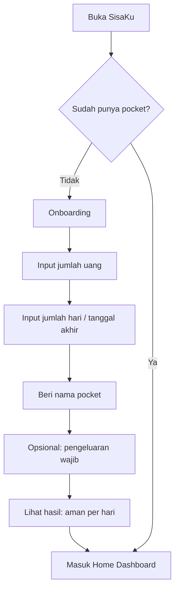

### Detail langkah

1. User membuka SisaKu.
2. Jika belum ada pocket, aplikasi menampilkan onboarding.
3. User memasukkan jumlah uang.
4. User memilih jumlah hari atau tanggal akhir.
5. User memberi nama pocket.
6. App menghitung safe-to-spend.
7. User masuk dashboard.

### Contoh

Input:
- Uang: Rp300.000
- Durasi: 7 hari
- Pocket: Uang Minggu Ini

Output:
- Aman per hari: Rp42.857
- Status: Aman

---

## 4. Returning User Flow

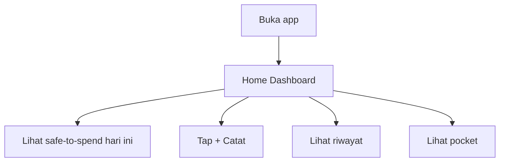

### Tujuan flow

User yang kembali tidak perlu mengatur ulang. App langsung menampilkan:
- pocket aktif;
- safe-to-spend hari ini;
- sisa uang;
- sisa hari;
- status budget;
- CTA catat pengeluaran.

---

## 5. Create Pocket Flow

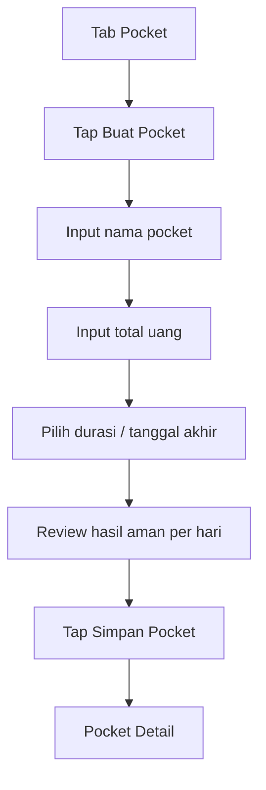

### Field wajib

- Nama pocket.
- Total uang.
- Durasi/tanggal akhir.

### Field opsional

- Deskripsi.
- Pengeluaran wajib.
- Kategori default.

### Validasi

| Kondisi | Respons |
|---|---|
| Total uang kosong | “Masukkan jumlah uang dulu.” |
| Total uang ≤ 0 | “Jumlah uang harus lebih dari 0.” |
| Durasi kosong | “Tentukan uang ini harus cukup sampai kapan.” |
| Durasi 0 hari | “Durasi minimal 1 hari.” |

---

## 6. Add Expense Flow

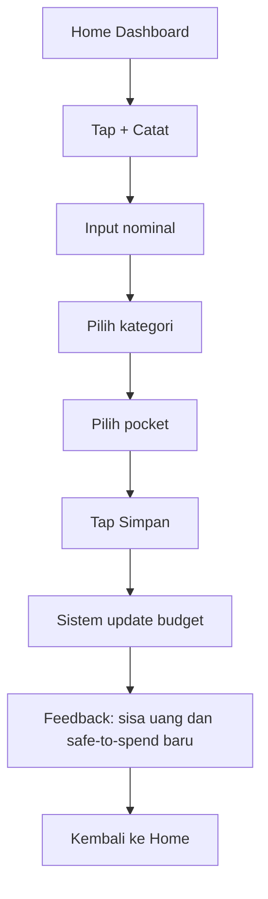

### Form utama

1. Nominal.
2. Kategori.
3. Pocket.
4. Simpan.

### Form opsional

- Nama transaksi.
- Tanggal.
- Catatan.

### Feedback setelah simpan

Contoh aman:
> Tercatat. Sisa uang Rp240.000. Hari ini masih aman.

Contoh waspada:
> Tercatat. Mulai mepet. Besok coba jaga di bawah Rp38.000.

Contoh bahaya:
> Tercatat. Uang mulai tipis. Prioritaskan makan dan transport dulu.

---

## 7. Quick Add Flow

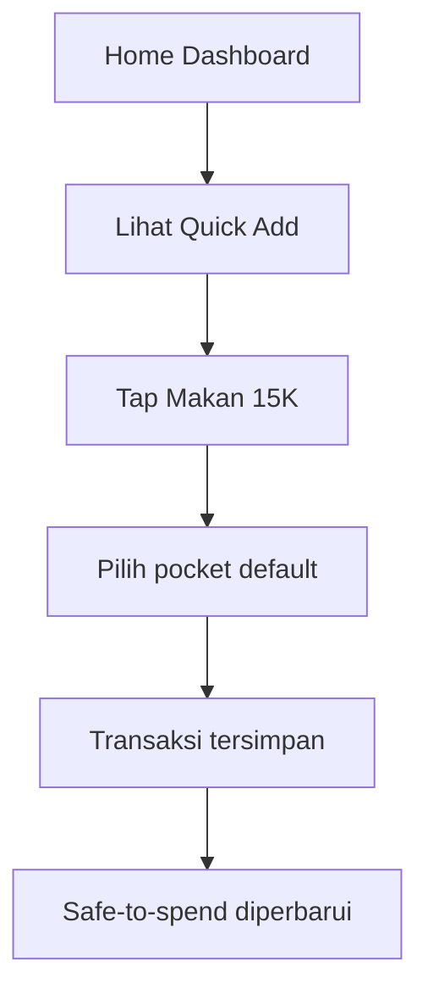

### Template awal

- Makan 15K.
- Kopi 12K.
- Transport 20K.
- Print 5K.
- Laundry 10K.

### Prinsip

Quick Add dibuat untuk transaksi kecil dan berulang. User tidak perlu mengetik jika pengeluaran mirip dengan template.

---

## 8. Pocket Detail Flow

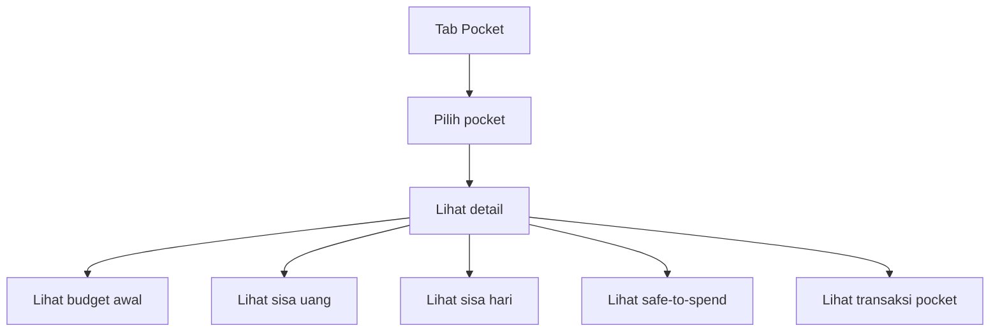

### Informasi utama

- Nama pocket.
- Budget awal.
- Total terpakai.
- Sisa uang.
- Sisa hari.
- Safe-to-spend.
- Status.
- Progress uang vs waktu.
- Recovery plan jika ada.

---

## 9. Edit Expense Flow

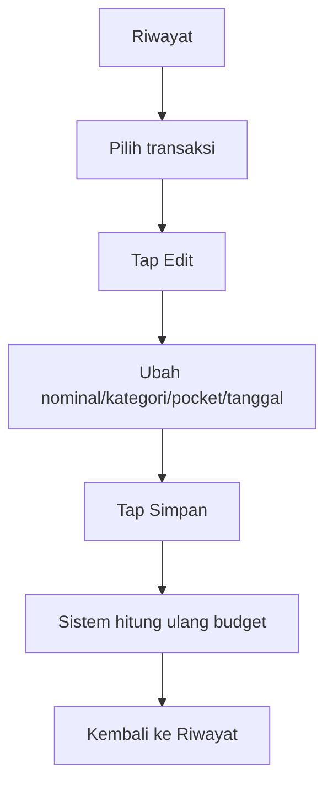

### Acceptance behavior

- Setelah transaksi diedit, semua kalkulasi pocket terkait diperbarui.
- Jika transaksi dipindah ke pocket lain, kedua pocket diperbarui.
- User melihat pesan sukses.

---

## 10. Delete Expense Flow

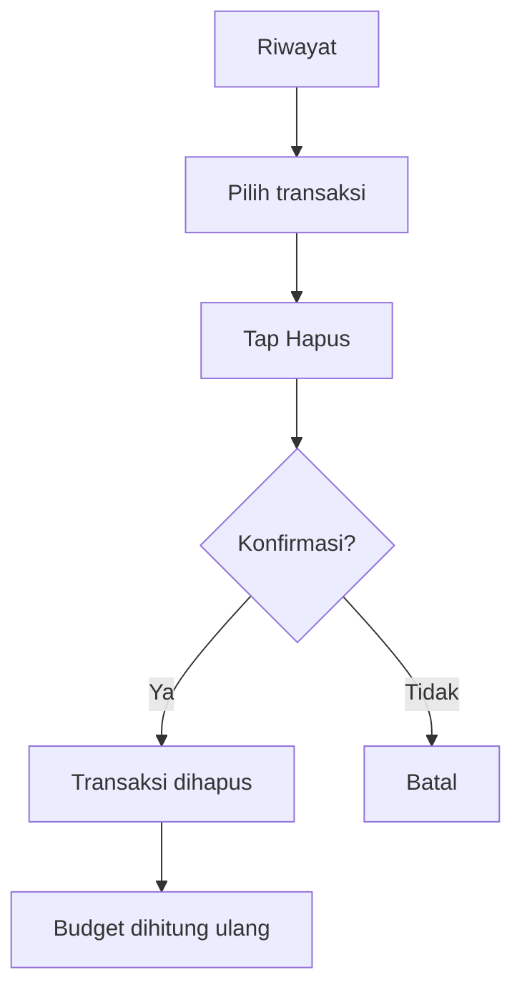

### Copy konfirmasi

> Hapus pengeluaran ini? Data yang dihapus tidak bisa dikembalikan.

---

## 11. Recovery Flow

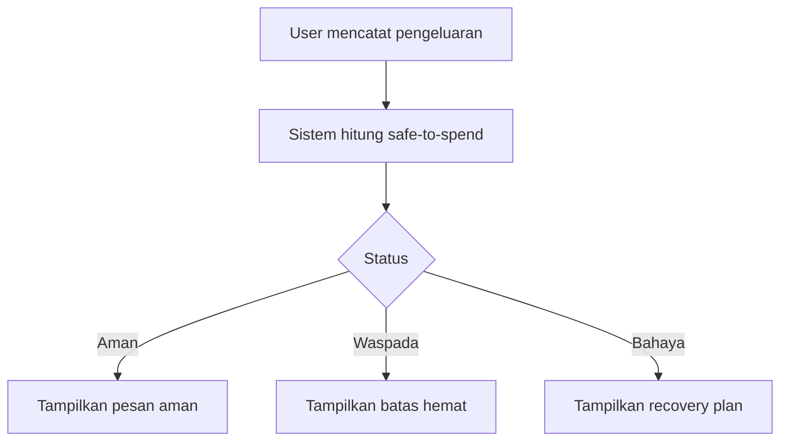

### Pesan recovery

Jika melewati batas harian:
> Hari ini lewat Rp12.000. Masih bisa aman kalau 3 hari ke depan jaga di bawah Rp35.000/hari.

Jika budget hampir habis:
> Uang mulai tipis. Prioritaskan makan, transport, dan kebutuhan kuliah dulu.

---

## 12. Export Data Flow

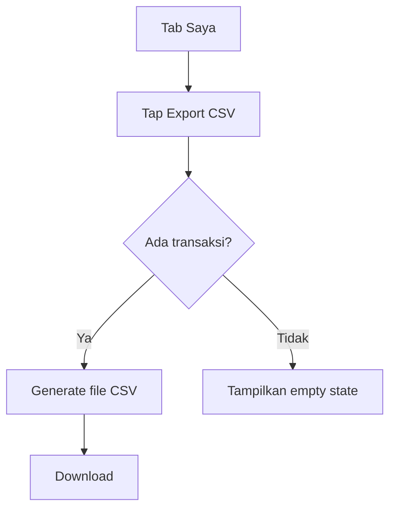

---

## 13. Reset Data Flow

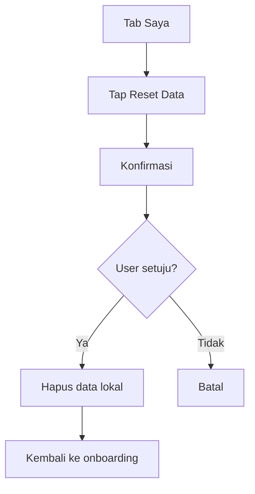

---

## 14. Critical User Paths

### Path 1 — Aha Moment

```text
Buka app → Input Rp300.000 untuk 7 hari → Lihat aman per hari Rp42.857
```

### Path 2 — Daily Habit

```text
Buka app → Tap + Catat → Input nominal → Pilih kategori → Simpan → Lihat sisa aman baru
```

### Path 3 — Recovery

```text
Catat pengeluaran besar → Status berubah Waspada/Bahaya → Lihat recovery plan → Sesuaikan pengeluaran
```

---

## 15. Empty States

| Screen | Empty state |
|---|---|
| Home tanpa pocket | “Buat pocket pertama untuk tahu batas aman harianmu.” |
| Riwayat kosong | “Belum ada pengeluaran. Mulai catat dari transaksi kecil.” |
| Pocket kosong | “Buat pocket seperti Uang Minggu Ini atau Uang Makan.” |
| Export kosong | “Belum ada data untuk diexport.” |

---

## 16. UX Risks

| Risiko | Solusi |
|---|---|
| User tidak paham pocket | Gunakan contoh “Rp300.000 untuk 7 hari” |
| User malas mencatat | Quick Add dan form 2 langkah |
| User merasa gagal | No shame copy + recovery plan |
| User lupa membuka app | Reminder malam opsional |
| Data hilang | Export CSV dan backup JSON di versi berikutnya |
